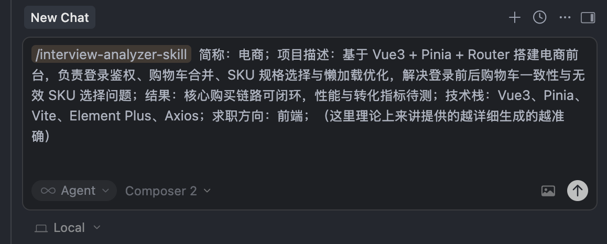
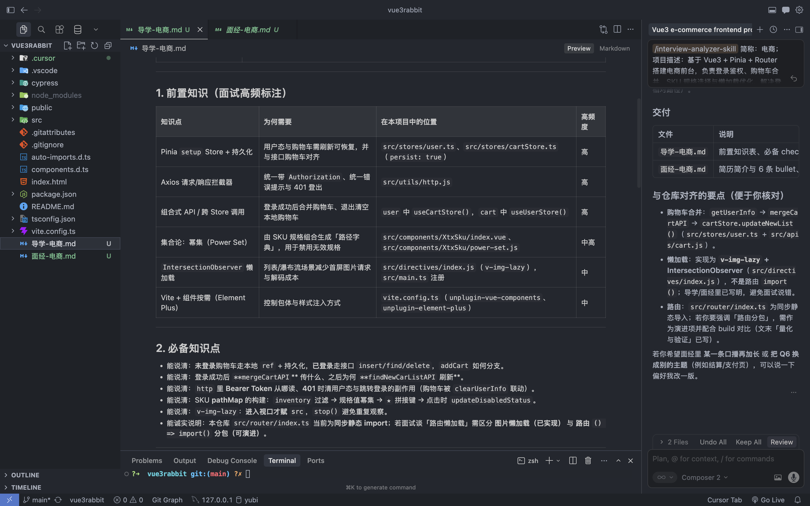
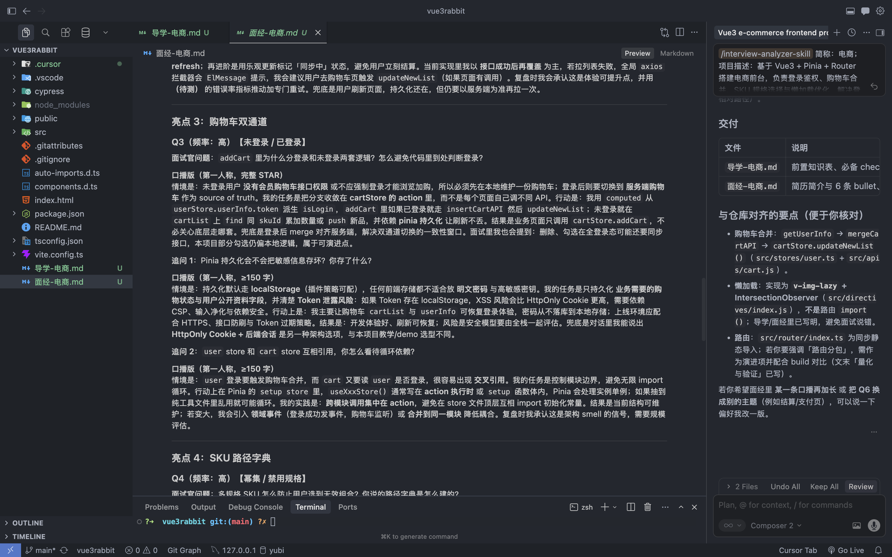

# interview-analyzer-skill

Turn a real project into two practical interview docs in your workspace root:

- `导学-{简称}.md`: key highlights, code-reading path, and study checklist
- `面经-{简称}.md`: resume-ready summary + interview-focused STAR speaking answers

This skill is designed for engineering interviews and avoids generic filler.

## Demo (3 Steps)

### 1. Trigger in chat

Use `/interview-analyzer-skill` with short name and project context.



### 2. Guidance output

The skill generates a guidance doc focused on what to learn first and where to read in the repo.



### 3. Interview output

The skill generates interview Q&A content with first-person STAR speaking answers.



## Outputs

| File | Purpose |
|------|---------|
| `导学-{简称}.md` | Prerequisites, key highlights, reading order, recommended repo paths, and optional measurement suggestions |
| `面经-{简称}.md` | 1-2 sentence resume summary, bullets, and 15-25 interview questions with STAR-style speaking answers |

## Quick Start

### 1) Clone this repository

```bash
git clone https://github.com/Jaxon1216/interview-analyzer-skill.git
cd interview-analyzer-skill
chmod +x install.sh
```

### 2) Install the skill

Auto-detect platform:

```bash
./install.sh
```

Common explicit installs:

```bash
./install.sh --platform cursor
./install.sh --platform cursor --project
./install.sh --platform copilot --project
./install.sh --platform codex --project
```

### 3) Use in a target project

Open your target project workspace, start a new chat, then trigger:

```text
/interview-analyzer-skill 简称：电商；项目描述：......（背景/职责/难点/结果）；技术栈：Vue3、Pinia、Vite；求职方向：前端
```

The skill writes output files to the target project's root.

## Repository Structure

- `SKILL.md`: skill contract and output requirements
- `references/`: rubrics and output templates
- `scripts/`: helper scripts for input checking and prompt building
- `install.sh`: cross-platform installer
- `image/`: README demo screenshots

## Upgrade

Installed skill folders are copied artifacts. They do not auto-update when this GitHub repo changes.

To upgrade:

```bash
cd interview-analyzer-skill
git pull
./install.sh --platform <your-platform> [--project]
```

## FAQ

### Do users need the whole repository?

Yes. The skill depends on `SKILL.md`, `references/`, `scripts/`, and `install.sh` together.

### Is measurement section mandatory in both docs?

No. It is an optional suggestion in guidance; interview doc does not require a separate measurement section.

### Can I use this with VS Code-based tools?

Yes. Use `--platform copilot`, `--platform cline`, or `--platform roo-code` depending on your setup.

## License

MIT
