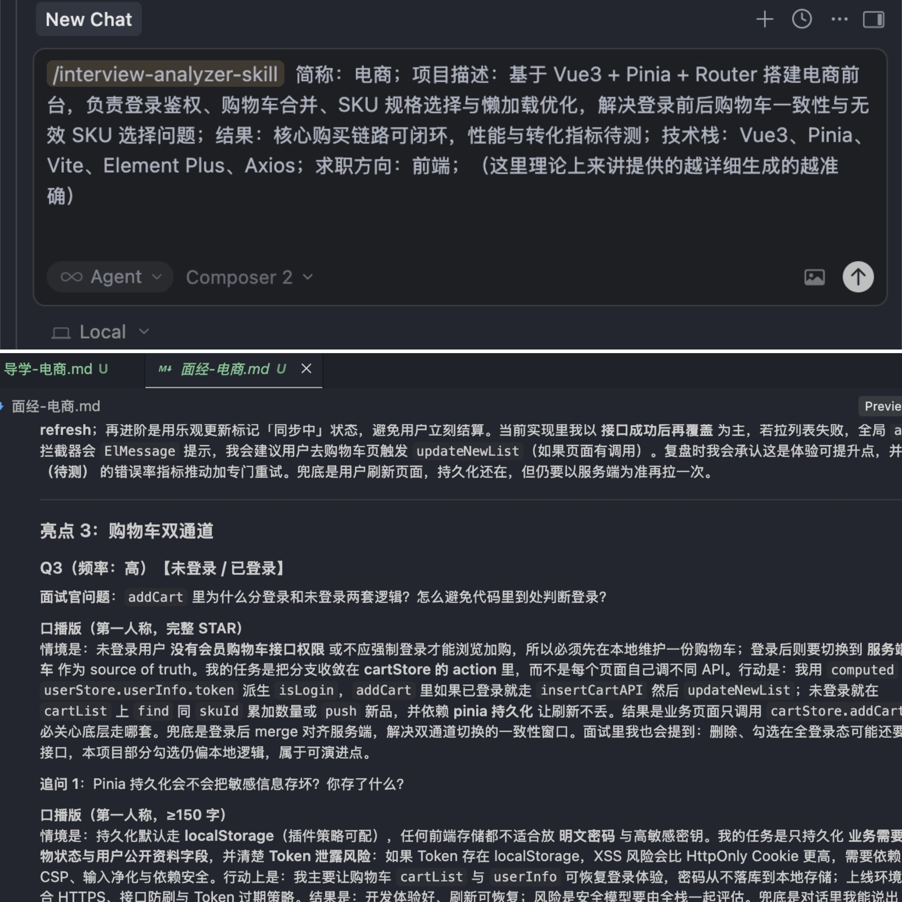

<div align="center">
  <h1>interview-analyzer-skill</h1>
  <p><a href="README_EN.md">English</a></p>
  <p><em>把你的项目经历，变成可复述、可追问、可上场的面试战斗手册。</em></p>
  <p>
    <a href="SKILL.md"></a>
    
    
    
    
    
  </p>
</div>

把真实项目快速整理成两份可直接用于面试准备的文档（输出到目标项目根目录）：

- `导学-{简称}.md`：重点亮点、代码阅读路径、学习顺序与必备知识点
- `面经-{简称}.md`：简历可用摘要 + 面试题口播（第一人称 STAR）

## 效果演示

下面这张合并图展示了触发输入与面经输出示例：



## 输出文件

| 文件 | 用途 |
|------|------|
| `导学-{简称}.md` | 前置知识、重点亮点与学习顺序、推荐阅读（含仓库相对路径）、关键设计决策、可选量化建议 |
| `面经-{简称}.md` | 1～2 句简历摘要、项目 bullets、15～25 道面试题（主问/追问口播） |

## 快速开始（更详细）

### 安装方式说明

当前是 **clone + install.sh** 安装方式（不是 `npx`）。

### 1）克隆仓库

```bash
git clone https://github.com/Jaxon1216/interview-analyzer-skill.git
cd interview-analyzer-skill
chmod +x install.sh
```

### 2）安装 skill

先看执行位置：

- 用户级安装（全局生效）：在 `interview-analyzer-skill` 仓库根目录执行。
- 项目级安装（仅当前项目生效）：先 `cd` 到目标项目根目录，再执行安装命令。

自动探测平台（适合快速开始）：

```bash
./install.sh
```

这条命令会自动判断你本机环境并安装 skill。  
如果你安装了多个工具（例如同时装了 Cursor 和 Copilot），建议用显式平台参数，避免装到你不想要的位置。

常见显式安装（按你的使用环境选择）：

```bash
./install.sh --platform cursor                 # 安装到用户级 Cursor 目录
./install.sh --platform cursor --project       # 安装到当前项目 .cursor/rules
./install.sh --platform copilot --project      # 安装到当前项目 .github/skills
./install.sh --platform codex --project        # 安装到当前项目 .agents/skills
```

如果你想“在目标项目里安装”，建议这样执行：

```bash
cd /path/to/your-project
/path/to/interview-analyzer-skill/install.sh --platform cursor --project
```

如果你不确定参数，可以先看帮助：

```bash
./install.sh --help
```

脚本当前支持的平台参数（`--platform`）包括：

`claude-code`、`copilot`、`cursor`、`windsurf`、`cline`、`codex`、`gemini`、`kiro`、`trae`、`goose`、`opencode`、`roo-code`、`antigravity`、`universal`

### 3）在目标项目里触发

在“被分析项目”的工作区开启新对话，比如输入：

```text
/interview-analyzer-skill 简称：电商；项目描述：......（背景/职责/难点/结果）；技术栈：Vue3、Pinia、Vite；求职方向：前端
```

随后会在目标项目根目录生成结果文件。

## 仓库结构

```text
interview-analyzer-skill/
|-- SKILL.md
|-- install.sh
|-- README.md
|-- README_EN.md
|-- demo.jpg
|-- references/
|   |-- interview-rubric.md
|   |-- star-framework.md
|   |-- output-templates.md
|   `-- oral-and-resume-patterns.md
`-- scripts/
    |-- check_inputs.py
    `-- build_prompt.py
```

## 升级说明

已安装目录是“拷贝产物”，不会随 GitHub 自动更新。

```bash
cd interview-analyzer-skill
git pull
./install.sh --platform <你的平台> [--project]
```

## 常见问题

### 输入写多详细比较好？

至少包含：项目背景、你的职责、一个关键难点、最终结果。越具体，生成题目越准。

### 生成后我该先看哪份文档？

建议先看 `导学`（明确学习路径），再看 `面经`（练口播与追问）。

### 量化与验证是强制的吗？

不是。它是导学中的可选建议项，面经不强制独立量化章节。

### 更新后会自动生效吗？

不会。需要拉取最新代码并重新执行 `install.sh`。

## Support

如果这个项目对你有帮助，欢迎：

- Star 这个仓库，支持持续维护
- Fork 后按你的面试场景定制规则
- 提交 Issue / PR，一起把它做得更实用

## License

MIT
