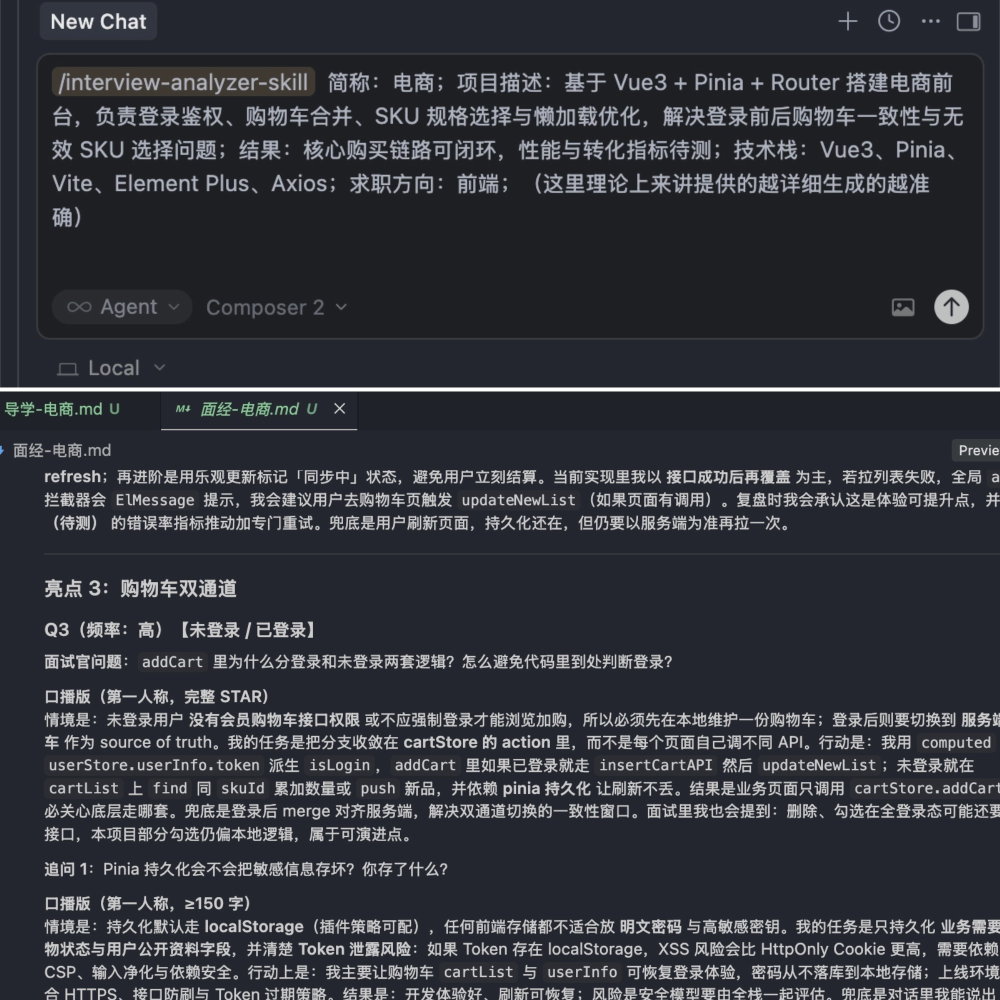

<div align="center">
  <h1>interview-analyzer-skill</h1>
  <p><a href="README_EN.md">English</a></p>
  <p><em>把你的项目经历，变成可复述、可追问、可上场的面试战斗手册。</em></p>
  <p>
    <a href="SKILL.md"></a>
    
    
    
    
    
  </p>
</div>

把真实项目快速整理成两份可直接用于面试准备的文档（输出到目标项目根目录）：

- `导学-{简称}.md`：重点亮点、代码阅读路径、学习顺序与必备知识点
- `面经-{简称}.md`：简历可用摘要 + 面试题口播（第一人称 STAR）

## 效果演示

下面这张合并图展示了触发输入与面经输出示例：



## 输出文件

| 文件 | 用途 |
|------|------|
| `导学-{简称}.md` | 前置知识、必备知识点、推荐阅读（含仓库相对路径）、原理与设计决策；文末可含 **「量化与验证（含待测）」**（建议，与 [SKILL.md](SKILL.md) 一致） |
| `面经-{简称}.md` | 1～2 句简历摘要、项目 bullets、15～25 道面试题（主问/追问口播）；**不强制**单独量化章节 |

## 快速开始（更详细）

当前是 **clone + install.sh**（不是 `npx`）。

### 安装前要分清的两件事

1. **Skill 装在哪**：`install.sh` 会把本仓库**整份拷贝**到编辑器约定的目录（例如 Cursor 的 `~/.cursor/rules/` 或某项目下的 `.cursor/rules/`）。只有这样，Agent 才能在对话里**加载这份规则**。
2. **导学 / 面经写在哪**：取决于你**在 IDE 里打开的是哪个文件夹**。在**业务项目**根目录打开工作区并触发 skill 后，`导学-*.md` 与 `面经-*.md` 会出现在**该业务项目的根目录**。这与 skill 的安装路径**不是同一处**。

### 1）克隆仓库

```bash
git clone https://github.com/Jaxon1216/interview-analyzer-skill.git
cd interview-analyzer-skill
chmod +x install.sh
```

### Windows 用户先看这里

`install.sh` 是 **POSIX shell** 脚本，不能直接在纯 `PowerShell` 里双击或裸跑。Windows 下推荐两种方式：

1. **Git Bash**：安装 Git for Windows 后，在仓库根目录执行 `bash ./install.sh --help`
2. **WSL**：进入 WSL shell 后再执行 `./install.sh --help`

如果你当前在 `PowerShell` 中：

```powershell
git clone https://github.com/Jaxon1216/interview-analyzer-skill.git
cd interview-analyzer-skill
bash ./install.sh --dry-run --platform cursor
```

看到 dry-run 列出目标目录和待拷贝文件，说明当前 shell 环境已经通了；再去掉 `--dry-run` 正式安装。

### 2）安装 skill

**推荐：自动探测（无参数）**——在已克隆的 **skill 仓库根目录**（`interview-analyzer-skill/`）执行：

```bash
./install.sh
```

**执行 `./install.sh` 后大致会发生什么**：

1. **校验**本目录下的 `SKILL.md`（含 frontmatter）是否可用。
2. **自动探测平台**：若未传 `--platform`，脚本会按固定顺序检查本机常见路径（例如存在 `~/.claude` 则视为 Claude Code；否则若存在 `~/.cursor` 或当前目录下有 `.cursor` 则视为 Cursor；再否则 Windsurf、Cline、Gemini 等，最后可能落到 Copilot / universal）。**命中第一个匹配**即作为安装目标。
3. **拷贝**本仓库中的 skill 内容到该平台的**默认用户级目录**（默认**不是**「当前业务项目」，而是你家目录下的约定路径，例如 Cursor 多为 `~/.cursor/rules/interview-analyzer-skill/`）。**不会**把 `install.sh` 自己拷进去。
4. 目标为 **Cursor** 时，会在安装目录额外生成 **`interview-analyzer-skill.mdc`**，便于规则加载。
5. **用户级安装**的部分平台组合下，可能还会在 **`~/.agents/skills/`** 下建立指向安装目录的链接（便于 Codex 等工具发现）。使用 `--project` 做项目级安装时不会写入 `~/.agents/skills/`，避免临时测试污染全局环境。
6. 终端输出 **成功** 提示与简短「接下来怎么用」说明。

若你本机**同时装了多种工具**，自动探测可能装到「最先被匹配到」的那一个；请改用下面表格中的 **`--platform`**（必要时加 **`--project`**）明确指定。

**其他场景：显式平台 / 只给某一个项目安装**

**务必看清「在哪个目录执行」**：用户级仍在 **skill 仓库根**里跑 `./install.sh ...`；只给某一个业务项目用时，在 **业务项目根**里用 **skill 的 `install.sh` 绝对路径**。

| 你的情况 | 在**哪个目录**执行 | 命令 | 装完后 skill 在哪（典型） |
|----------|-------------------|------|---------------------------|
| Cursor，所有项目都能用 | **skill 仓库根**（`interview-analyzer-skill/`） | `./install.sh --platform cursor` | `~/.cursor/rules/interview-analyzer-skill/`，内含 `SKILL.md` 与 `interview-analyzer-skill.mdc` |
| Cursor，只给**某一个**业务项目 | **业务项目根** | `/path/to/interview-analyzer-skill/install.sh --platform cursor --project` | `业务项目/.cursor/rules/interview-analyzer-skill/`（同样有 `.mdc`） |
| VS Code + Copilot，仅当前项目 | **业务项目根** | `/path/to/interview-analyzer-skill/install.sh --platform copilot --project` | `业务项目/.github/skills/interview-analyzer-skill/` |
| Codex / 其他读 `.agents/skills` 的工具 | **业务项目根** | `/path/to/interview-analyzer-skill/install.sh --platform codex --project` | `业务项目/.agents/skills/interview-analyzer-skill/` |

将 `/path/to/interview-analyzer-skill` 换成你本机克隆下来的真实路径。

更多参数：

```bash
./install.sh --help
```

支持的 `--platform` 值（节选，完整见 `--help`）：`claude-code`、`copilot`、`cursor`、`windsurf`、`cline`、`codex`、`gemini`、`kiro`、`trae`、`goose`、`opencode`、`roo-code`、`antigravity`、`universal`

### 3）确认安装是否成功

- 打开上表中 **「装完后 skill 在哪」** 对应文件夹，应能看到 **`SKILL.md`**；使用 Cursor 时同一目录下还应有 **`interview-analyzer-skill.mdc`**。
- **效果验证**：用 Cursor（或其他已配置的工具）**打开业务项目根目录**，新建对话，输入 `/interview-analyzer-skill`（或描述「写导学、面经」）。规则生效时，Agent 会按 [SKILL.md](SKILL.md) 在**业务根目录**生成两个 `.md`；若环境无法写文件，应给出两个可保存的 Markdown 代码块。

### 可选：安装前预览（不写入磁盘）

在**业务项目根**执行（路径按你本机修改）：

```bash
cd /path/to/your-project
/path/to/interview-analyzer-skill/install.sh --platform cursor --project --dry-run
```

终端会打印将要创建的路径与拷贝列表，确认无误后再去掉 `--dry-run` 执行一次。

### 4）在业务项目里触发

在**被分析项目**的工作区开启新对话，例如：

```text
/interview-analyzer-skill 简称：电商；项目描述：......（背景/职责/难点/结果）；技术栈：Vue3、Pinia、Vite；求职方向：前端
```

随后在**该业务项目根目录**生成 `导学-电商.md`、`面经-电商.md`（简称以你输入为准）。

## 仓库结构

```text
interview-analyzer-skill/
|-- SKILL.md
|-- install.sh
|-- README.md
|-- README_EN.md
|-- demo.jpg
|-- donate.jpg
|-- LICENSE
|-- references/
|   |-- interview-rubric.md
|   |-- star-framework.md
|   |-- output-templates.md
|   `-- oral-and-resume-patterns.md
`-- scripts/
    |-- check_inputs.py
    `-- build_prompt.py
```

## 升级说明

已安装目录是“拷贝产物”，不会随 GitHub 自动更新。

```bash
cd interview-analyzer-skill
git pull
./install.sh --platform <你的平台> [--project]
```

## 常见问题

### 输入写多详细比较好？

至少包含：项目背景、你的职责、一个关键难点、最终结果。越具体，生成题目越准。

### 生成后我该先看哪份文档？

建议先看 `导学`（明确学习路径），再看 `面经`（练口播与追问）。

### 量化与验证是强制的吗？

不是。与 [SKILL.md](SKILL.md) 一致：**导学**可在文末增加「量化与验证（含待测）」为**建议**（性能类可写清如何测）；**面经**不要求单独量化章节。

### 更新后会自动生效吗？

不会。需要拉取最新代码并重新执行 `install.sh`。

## 本地验证

这两个 Python 辅助脚本可以直接跑最小回归测试，无需额外依赖：

```bash
python -m unittest discover -s tests -v
```

建议在修改 `scripts/`、`SKILL.md` 输入契约、或 README 中的安装示例后跑一遍。

## 反馈与支持

觉得有帮助？欢迎 **buy me a coffee**——金额随意：


- 需求 / 建议 / 商用 / 二开：**jiangxu05@outlook.com**
- 欢迎 **Star**、**Fork** 按场景定制、**Issue / PR** 一起改进

## License

本项目采用 **MIT License**，完整条款见 **[LICENSE](LICENSE)**（**英文正文 + 中文参考译文**；若理解有出入，以英文为准）。

使用或再分发本软件时：**请保留**版权与许可声明；**商用 / 二开** 请**标注来源**（例如本仓库链接），便于他人找到原版。
